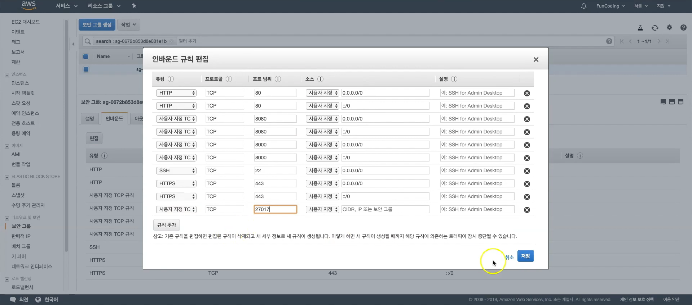
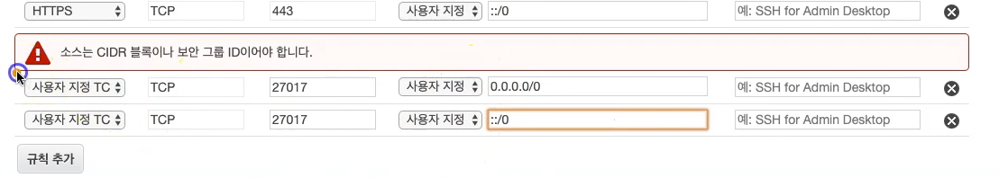
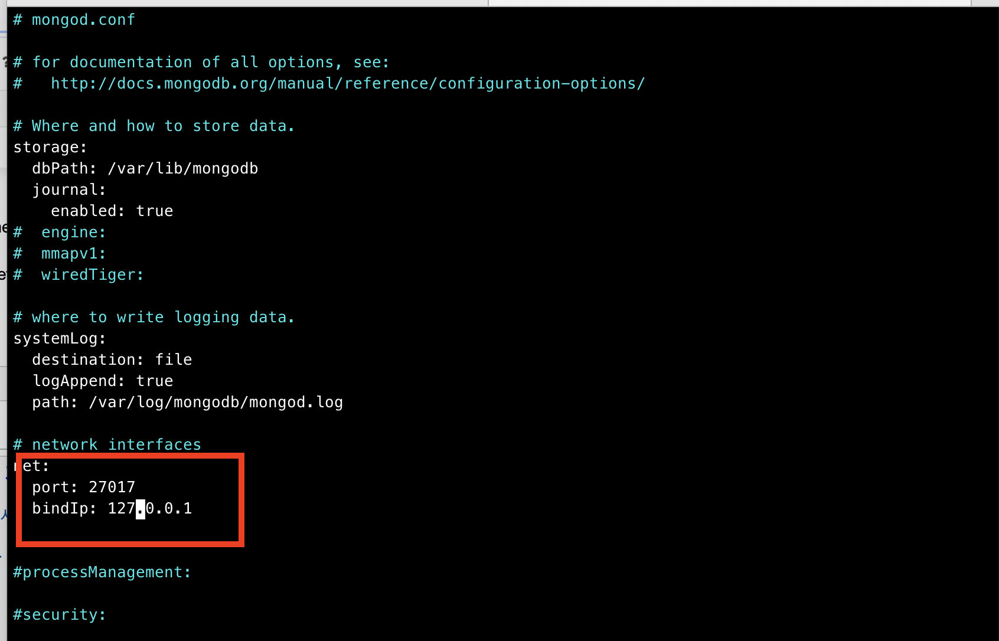
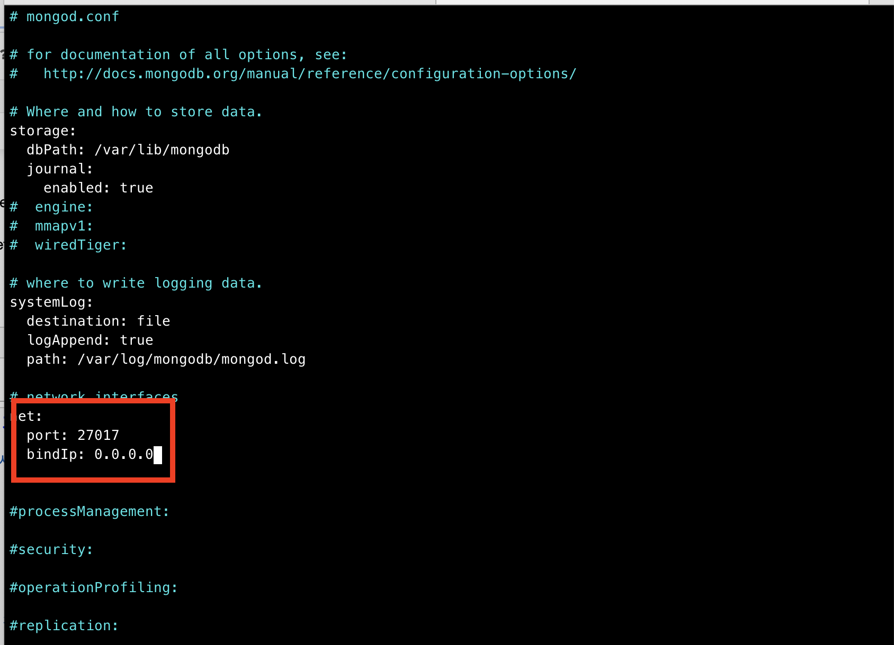

# AWS Mongo-DB setting


- #### 클라우드에 몽고DB 설치하기


- 우분투 EC2 생성. 

- EC2 탄력적 IP 생성 후, 현재 인스턴스에 연결해 준다. 

- #### 터미널에서 접속 가능

  pem 있는 곳으로 가서 

  1. `chmodd 400 <파일명.pem>` - 파일의 권한을 미리 제한을 해 두는것. 소유자 만 읽을 수 있도록. 
  2. `ssh -i <파일명.pem> ubuntu@54.179.203.15` - 한방에 접속 하겠다. 

  3. 지금부터는 aws에 접속한 것. 
  4. 나올때는 `exit`를 누르면 된다. 


- ### EC2(AWS 서버)에 mongodb 설치 방법 (ubuntu 기반)

  * Import the public key(GPG key) used by the package management system(몽고디비 다운받을수 있는 서버로 연결).
    - sudo apt-key adv --keyserver hkp://keyserver.ubuntu.com:80 --recv 0C49F3730359A14518585931BC711F9BA15703C6
  * Create a list file for MongoDB(우리 서버에다가 이제부터 몽고디비도 관리하겠다고 알려주는 것).
    - echo "deb [ arch=amd64,arm64 ] http://repo.mongodb.org/apt/ubuntu xenial/mongodb-org/3.4 multiverse" | sudo tee /etc/apt/sources.list.d/mongodb-org-3.4.list
  * Reload local package database(위에서 올려놓은 list를 한번 쭉 훑으면서 최신이 있는지 체크하고 아니면 업데이트 혹은 설치).
    - sudo apt-get update 
  * Install the MongoDB packages.
    - sudo apt-get install -y mongodb-org
    - mpngodb-org 패키지(위 명령어로 같이 설치되는 것): A metapackage that will automatically install the four component packages, mongodb-org-server, mongodb-org-mongos, mongodb-org-shell, and mongodb-org-tools
    - The MongoDB instance stores its data files in **/var/lib/mongodb** and its log files in **/var/log/mongodb** by default, and runs using the mongodb user account. You can specify alternate log and data file directories in /etc/mongod.conf.
    
  * **EC2(AWS 서버)에 mongodb  설정 방법 (ubuntu 기반) 부분으로 갈것.** 
      * 스타트 하기 전에 포트 확인 몽고DB는 디폴트로 27017 포트를 사용. 그런데, EC2는 아무 포트나 사용할 수 있게 열어두지 않음. 
        - 근데 우리가 27017번 포트를 열겠다고 설정을 한 적이 없잖아. 
        - 내 AWS인스턴스 - 보안그룹 - 인바운드 규칙 추가 - 사용자지정 TCP 27017 저장해야 함. 

      * 그 다음 하단의 설정방법으로 가서 "외부 접속 허용" 해줘야함. 

  * Start MongoDB
    - sudo service mongod start
  * Verify that MongoDB has started successfully
    - Verify that the mongod process has started successfully by checking the contents of the log file at /var/log/mongodb/mongod.log for a line reading
    - [initandlisten] waiting for connections on port <port>
    - where <port> is the port configured in /etc/mongod.conf, 27017 by default.
  * Stop MongoDB
    - sudo service mongod stop

  

  

  

- ### EC2(AWS 서버)에 mongodb 설정 방법 (ubuntu 기반)

  - AWS Management Console -> EC2 -> Security Groups -> EC2's Security Group -> Add Custom TCP Rule, 27017, AnyWhere

  - 외부 접속 허용

    - sudo vi /etc/mongod.conf
      - bindIp: 0.0.0.0 으로 변경

    

    

    - sudo service mongod restart

  - 계정을 만들어야 함 (그렇지 않으면 외부에서 해당 포트/주소로 아무나 접속이 가능하기 때문)

    - EC2 에서 다음 명령 실행(이건 안했는데 문제 없었음)

  ```
  mongo
  use admin
  db.createUser( 
      {   user: "davelee",
          pwd: "korea123",
          roles: [ "userAdminAnyDatabase",
          "dbAdminAnyDatabase",
          "readWriteAnyDatabase"] 
      } 
  )
      - sudo vim /etc/mongod.conf
      - Add the following configurations
  security:
    authorization: enabled
     - sudo service mongod restart
  ```